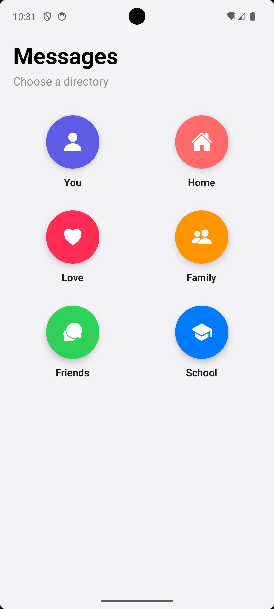
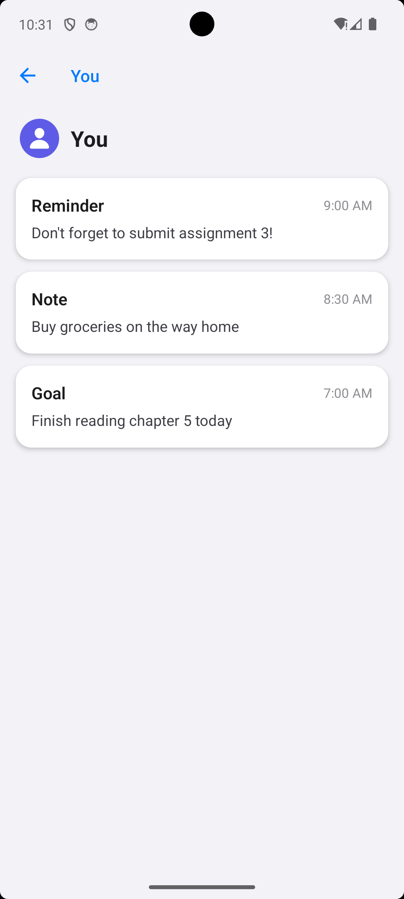
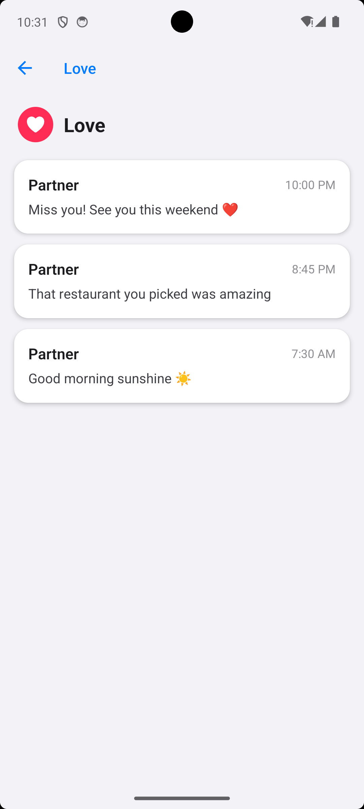
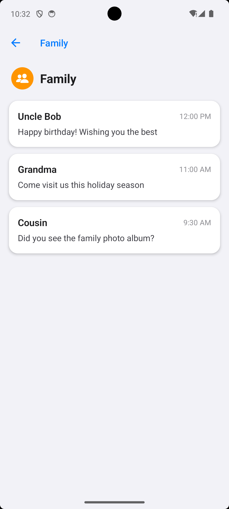
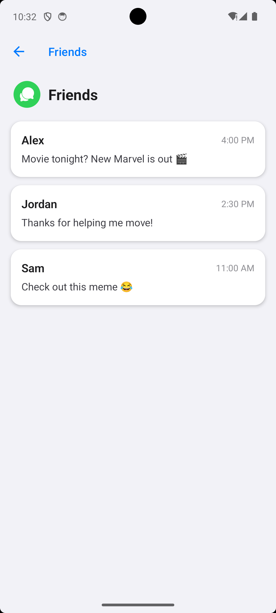
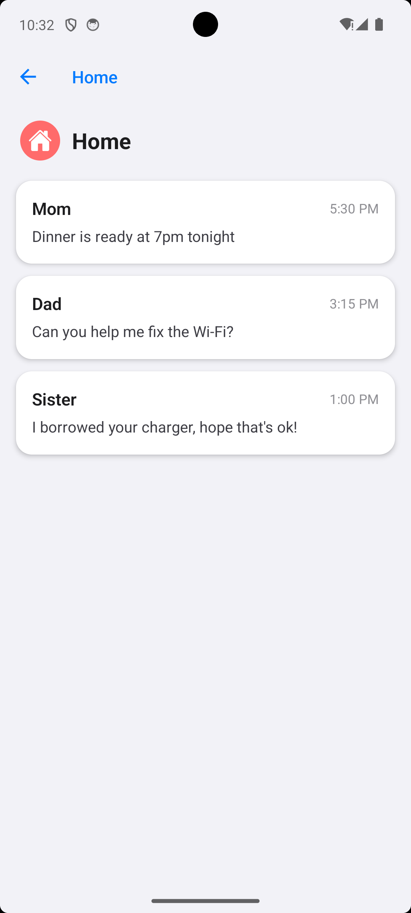
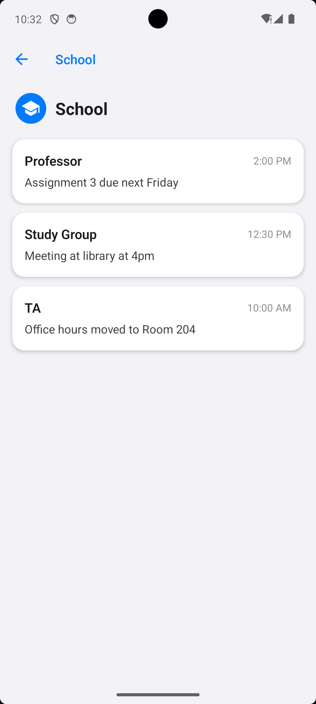
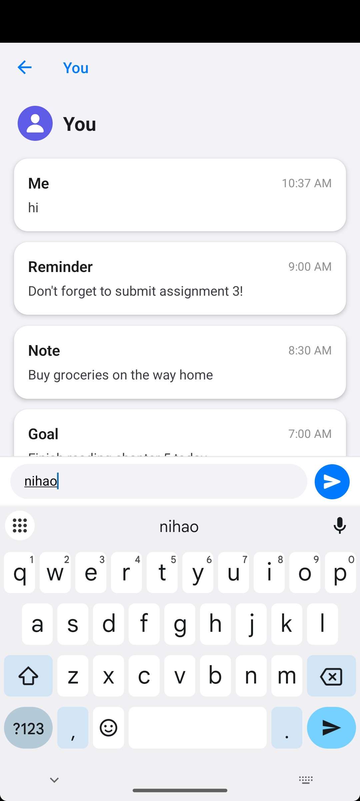
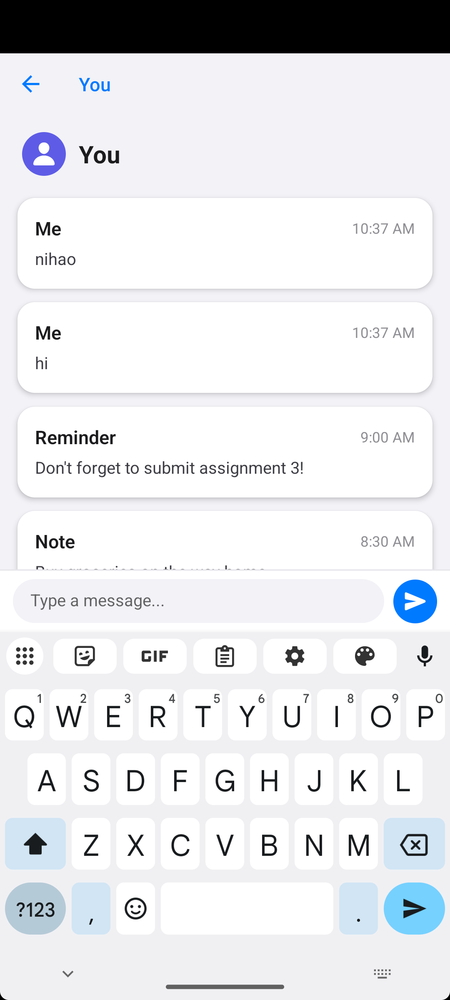

# React Native Messages Directory

## Project Description

A React Native message directory app built with Expo and TypeScript. The app displays a list of 6 message categories (You, Home, Love, Family, Friends, School). Clicking any category shows the stored messages for that directory. Users can also send new messages within each category.

## Tech Stack

- React Native (Expo SDK 54)
- TypeScript
- React Navigation (Native Stack)
- Expo Vector Icons

## Project Structure

- App.tsx - App entry with navigation stack
- index.ts - Expo entry point
- src/data/messages.ts - Category and message data
- src/screens/HomeScreen.tsx - Home screen with category grid
- src/screens/MessagesScreen.tsx - Messages list with send functionality
- package.json - Dependencies
- tsconfig.json - TypeScript configuration

## How to Configure and Run

### Prerequisites

- Node.js (v18+)
- npm
- Expo CLI
- Android Studio (for Android Emulator) or Xcode (for iOS Simulator)

### Installation

```bash
# Install dependencies
npm install
```

### Run on Android Emulator

```bash
# Start the app
npx expo start --android
```

### Run on iOS Simulator

```bash
# Start the app
npx expo start --ios
```

### Run on Physical Device

1. Install **Expo Go** from Google Play (Android) or App Store (iOS)
2. Run `npx expo start`
3. Scan the QR code with your phone (same Wi-Fi network required)

## Features

1. **Home Screen** — Displays 6 message categories in a grid layout with colorful icons
2. **Messages Screen** — Shows stored messages as cards with sender name, content, and timestamp
3. **Send Messages** — Users can type and send new messages within each category

## Screenshots

### Home Screen


### You Messages


### Love Messages


### Family Messages


### Friends Messages


### Home Messages


### School Messages


### Send Message Feature


